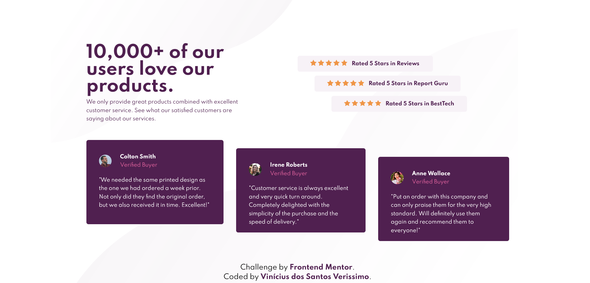

# Frontend Mentor - Social proof solution

This is a solution to the [Order summary card challenge on Frontend Mentor](https://www.frontendmentor.io/challenges/order-summary-component-QlPmajDUj). 

## Overview

### Screenshot

### Links

- Solution URL: Working on it.

## My process

### Built with

- Semantic HTML5 markup
- CSS custom properties
- Flexbox

### What I learned

In this project i could learn more about the different uses of the flexbox features, and also how to change the elements positions to addapt them to a smaller screen, using media queries.

## Author

- GitHub - Vinícius dos Santos Verissimo (https://github.com/viniciusdsv93)
